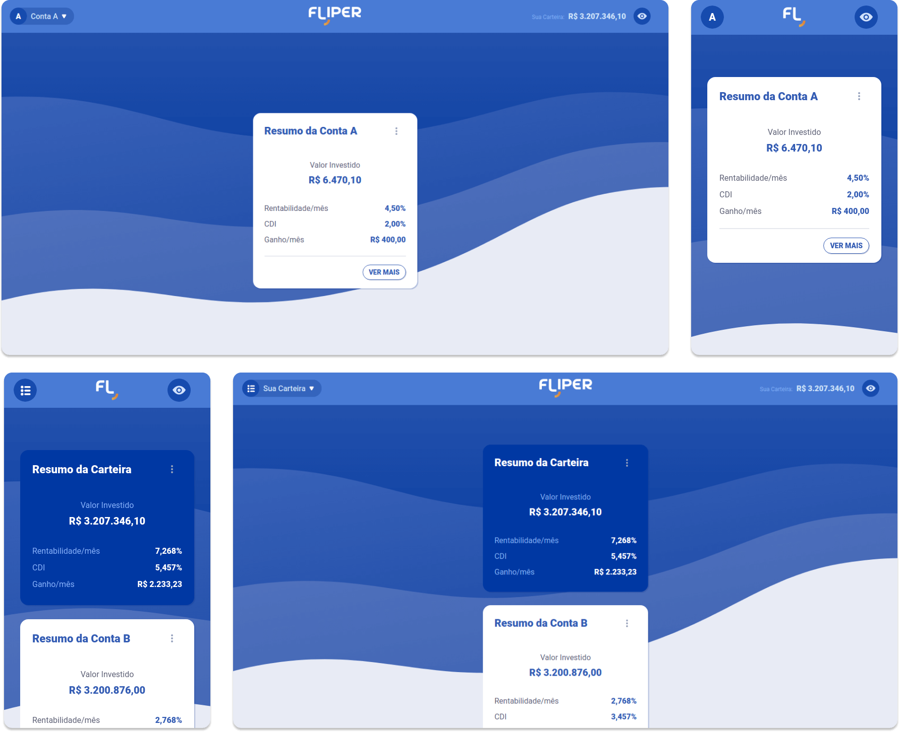

# Fliper

👉 **Veja o App em funcionamento**: https://eng-zap-challenge-javascript-romulorvs.vercel.app/

---

Controle todos os seus investimentos de forma automática e faça uma gestão inteligente da sua carteira. A **Fliper** é uma plataforma que permite você consolidar todos seus ativos em um único lugar.

---

## Screenshots (Web e Mobile)

---

## Instalação

1. Clone este Repositório.
2. Vá até o diretório do Repositório e execute ``npm i`` para instalar as dependências.

## Execução

Para executar a aplicação localmente:
- Execute ``npm run start`` no terminal.

Para buildar a aplicação:
- Execute ``npm run build`` no terminal.

## Testes

Para executar os testes:
- Execute ``npm run test``.